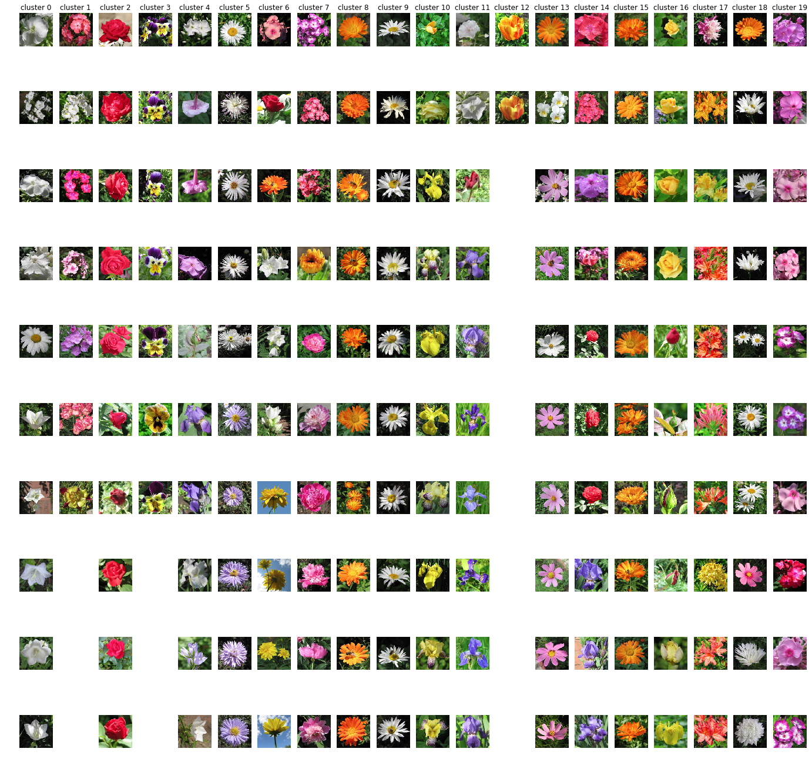

# flower clustering
Training a simple ConvNet to classify fruits and vegetables with PyTorch

[Dataset](https://www.kaggle.com/olgabelitskaya/flower-color-images) is available in kaggle. Download the dataset, unzip it to where .ipynb file is.

In this dataset, there are 20 classes and 603 flower images.

Clustering achieved by 3 steps.

- Extract features from vgg-16 (remove the last relu-dropout-linear layer) for every single image.
- Apply PCA to decrease the number of features from 4096 to 400.
- Apply kmeans algorithm with k = 20


Install the required libraries
```bash
$ pip install -r requirements.txt
```

Then run the script cell by cell.


# Results
Clusters (each column is a cluster)

Some clusters doesn't have 10 images, that's why this subplot is not filled.
|  | 
|:--:| 
| clustering results |


## Clusters

### Cluster 0
|  | 
|:--:| 
| Cluster 0 |

### Cluster 1
|  | 
|:--:| 
| Cluster 1 |

### Cluster 2
|  | 
|:--:| 
| Cluster 2 |

### Cluster 3
|  | 
|:--:| 
| Cluster 3 |

### Cluster 4
|  | 
|:--:| 
| Cluster 4 |

### Cluster 5
|  | 
|:--:| 
| Cluster 5 |

### Cluster 6
|  | 
|:--:| 
| Cluster 6 |

### Cluster 7
|  | 
|:--:| 
| Cluster 7 |

### Cluster 8
|  | 
|:--:| 
| Cluster 8 |

### Cluster 9
|  | 
|:--:| 
| Cluster 9 |

### Cluster 10
|  | 
|:--:| 
| Cluster 10 |

### Cluster 11
|  | 
|:--:| 
| Cluster 11 |

### Cluster 12
|  | 
|:--:| 
| Cluster 12 |

### Cluster 13
|  | 
|:--:| 
| Cluster 13 |

### Cluster 14
|  | 
|:--:| 
| Cluster 14 |

### Cluster 15
|  | 
|:--:| 
| Cluster 15 |

### Cluster 16
|  | 
|:--:| 
| Cluster 16 |

### Cluster 17
|  | 
|:--:| 
| Cluster 17 |

### Cluster 18
|  | 
|:--:| 
| Cluster 18 |

### Cluster 19
|  | 
|:--:| 
| Cluster 19 |
